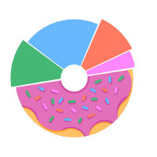

# School of Data LA 2019

Source code for Austin Transportation's [School of Data LA 2019](https://schoolofdata.la/) workshop.

## Outline

We'll be using Signal Request data similar to our existing "Data Tracker" Knack application.

### Python Data ETL

- Python Client
  - download repo
  - `pip install -requirments`
- Extract/Download via Knack API
- Transform \*optional
  - filter or GIS join?
- Load data
  - PostgREST Sandbox
  - www.endpoint.internet

### Javascript Dataviz

- `npm install create-react-app`
- `create-react-app school-of-data-example`
- live code components
  - get signal request data from Socrata API or PostgREST endpoint:
  - https://data.austintexas.gov/Transportation-and-Mobility/Traffic-and-Pedestrian-Signal-Requests/f6qu-b7zb
- For auto-reloading dev server: `npm start`
- For production assets build: `npm run build`
- deploy to gh-pages
